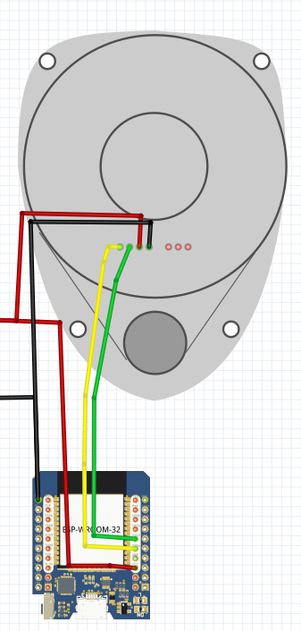

# OVERVIEW

* This program demonstrates how an ESP32 can interface a SLAMTEC RPLIDAR C1 and publish /scan to ROS2 by microros at 10 Hz.

# NOTES

* I tested it only with the RPLIDAR C1 model (it's the only lidar I have :smiley: ).
* I suppose it could work with SLAMTEC S series also, as the protocols for C and S series are the same. See here: https://bucket-download.slamtec.com/c5971f2703a8d014f3925694d798ea490a370efa/LR001_SLAMTEC_rplidar_S&C%20series_protocol_v2.8_en.pdf
* I used an ESP32 D1 Mini but I'm pretty sure any ESP32 will suffice.

# SCHEMATIC

The Power Supply must be around 5.2Vcc

